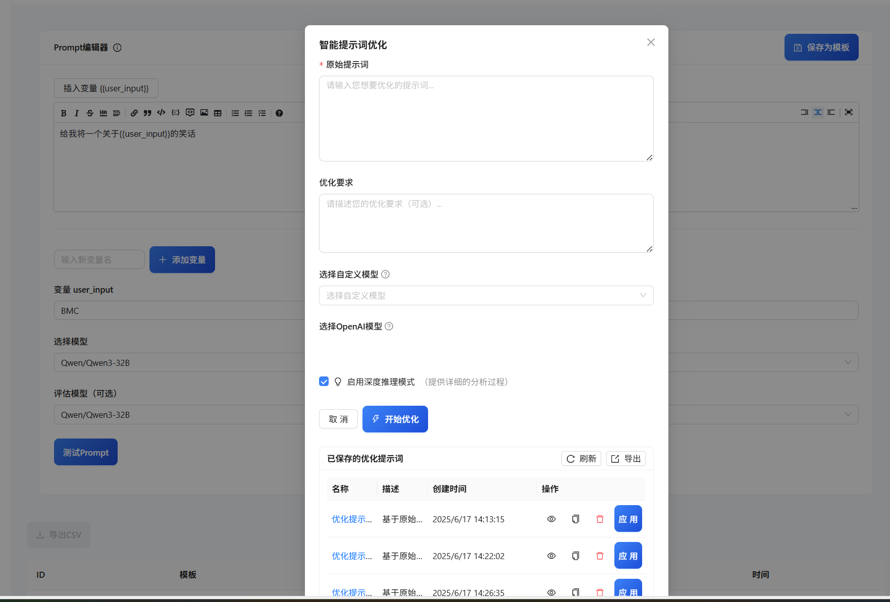
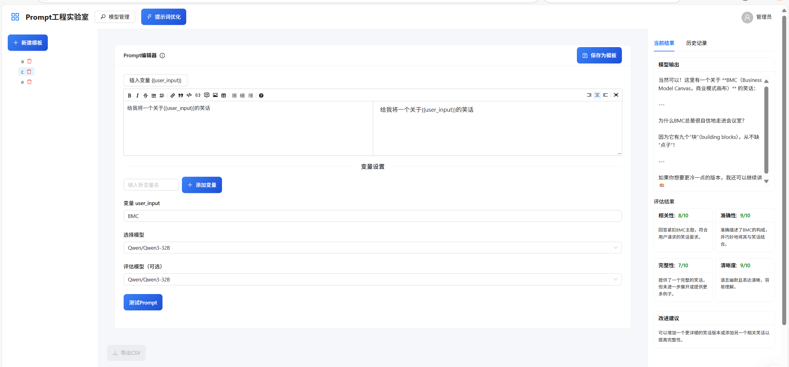

# Prompt Lab

Prompt Lab是一个提示词实验室工具，用于创建、测试和优化AI模型的提示词。该工具支持多种AI模型，包括OpenAI、Anthropic、国内的文心一言、讯飞星火等。

## 功能特点

- 📝 提示词模板管理：创建、编辑和组织提示词模板
- 🧪 提示词测试：使用不同的AI模型测试提示词效果
- 📊 响应评估：评估AI模型响应的质量
- 🔄 提示词优化：自动优化提示词以获得更好的响应，支持通用优化、函数调用优化和图像生成优化，并具有结果格式保障机制
- 📚 历史记录：保存和查看历史提示词和响应
- 👤 用户管理：支持多用户使用，权限控制

### 界面展示

#### 首页


#### 提示词优化


#### 模型管理


## 最近更新

- **2024-07-XX**: 修复了函数调用优化时返回评估结构而不是优化结果的问题，增强了结果格式保障机制
- **2024-07-XX**: 优化了提示词优化模块的稳定性和可靠性
- **2024-07-XX**: 增加了对更多AI模型的支持

## 技术栈

- 后端：FastAPI (Python)
- 前端：React
- 数据库：SQLite
- AI模型支持：OpenAI、Anthropic、Deepseek、Qwen、文心一言、讯飞星火、ModelScope等

## 项目结构

```
prompt-lab/
├── alembic/                   # 数据库迁移相关文件
│   ├── versions/              # 数据库迁移版本
│   ├── env.py                 # Alembic环境配置
│   └── script.py.mako         # 迁移脚本模板
├── app/                       # 后端应用
│   ├── components/            # 共享组件
│   ├── migrations/            # 数据库迁移脚本
│   ├── models/                # 数据模型定义
│   ├── pages/                 # 页面组件
│   ├── routers/               # API路由
│   │   ├── auth.py            # 认证相关API
│   │   ├── evaluate.py        # 评估相关API
│   │   ├── history.py         # 历史记录API
│   │   ├── models.py          # 模型管理API
│   │   ├── prompt_optimize.py # 提示词优化API
│   │   ├── prompts.py         # 提示词管理API
│   │   ├── responses.py       # 响应管理API
│   │   ├── templates.py       # 模板管理API
│   │   └── test.py            # 测试相关API
│   ├── services/              # 业务逻辑服务
│   │   ├── auth_service.py    # 认证服务
│   │   ├── evaluator.py       # 评估服务
│   │   ├── model_adapter.py   # 模型适配器
│   │   ├── prompt_optimizer.py # 提示词优化服务
│   │   └── response_evaluator.py # 响应评估服务
│   ├── types/                 # 类型定义
│   ├── config.py              # 应用配置
│   ├── database.py            # 数据库配置
│   ├── main.py                # 应用入口
│   ├── models.py              # 数据模型
│   └── websocket.py           # WebSocket处理
├── public/                    # 静态文件
├── src/                       # 前端源代码
│   ├── components/            # 前端组件
│   │   ├── HistoryTable.js    # 历史记录表格
│   │   ├── ModelManagerModal.js # 模型管理模态框
│   │   ├── PromptEditor.js    # 提示词编辑器
│   │   ├── PromptList.js      # 提示词列表
│   │   ├── PromptOptimizer.js # 提示词优化器
│   │   ├── TemplateEditor.js  # 模板编辑器
│   │   ├── TemplateList.js    # 模板列表
│   │   └── ...                # 其他组件
│   ├── pages/                 # 页面组件
│   │   ├── App.js             # 主应用页面
│   │   └── Login.js           # 登录页面
│   ├── services/              # API服务
│   │   ├── api.js             # 基础API
│   │   ├── authApi.js         # 认证API
│   │   └── promptApi.js       # 提示词API
│   ├── stores/                # 状态管理
│   │   └── authStore.js       # 认证状态
│   ├── App.js                 # 应用入口
│   └── index.js               # 渲染入口
├── .gitignore                 # Git忽略文件
├── alembic.ini                # Alembic配置
├── env.example                # 环境变量示例
├── init_admin.py              # 初始化管理员脚本
├── LICENSE                    # 许可证
├── package.json               # 前端依赖
├── README.md                  # 项目说明
├── requirements.txt           # 后端依赖
└── start.py                   # 启动脚本
```

## 核心文件说明

### 后端核心文件

- **app/main.py**: 应用主入口，配置FastAPI应用和路由
- **app/config.py**: 应用配置，包括API密钥、JWT设置等
- **app/database.py**: 数据库连接配置
- **app/models.py**: 数据库模型定义
- **app/services/model_adapter.py**: 模型适配器，用于连接不同的AI模型API
- **app/services/prompt_optimizer.py**: 提示词优化服务，用于自动优化提示词
- **app/routers/**: API路由目录，包含所有后端API端点

### 前端核心文件

- **src/App.js**: 前端应用主入口
- **src/components/PromptEditor.js**: 提示词编辑组件
- **src/components/PromptOptimizer.js**: 提示词优化组件
- **src/components/ModelManagerModal.js**: 模型管理组件
- **src/services/api.js**: API调用服务

### 配置和工具文件

- **start.py**: 一键启动脚本，启动前后端服务
- **init_admin.py**: 初始化管理员账户
- **alembic.ini** 和 **alembic/**: 数据库迁移配置和脚本
- **env.example**: 环境变量配置示例

## 安装说明

### 环境要求

- Python 3.8+
- Node.js 14+
- npm 6+

### 后端安装

1. 克隆仓库
```bash
git clone https://github.com/yourusername/prompt-lab.git
cd prompt-lab
```

2. 安装Python依赖
```bash
pip install -r requirements.txt
```

3. 配置环境变量
创建`.env`文件，参考`env.example`配置API密钥和其他设置：
```
DEFAULT_API_KEY=your-api-key
DEFAULT_PROVIDER=openai
JWT_SECRET_KEY=your-secret-key
```

4. 数据库迁移
```bash
# 初始化数据库
python -m alembic upgrade head
```

### 前端安装

1. 安装Node.js依赖
```bash
npm install
```

## 使用方法

1. 启动应用
```bash
python start.py
```

2. 访问应用
- 前端：http://localhost:3000
- API文档：http://localhost:8000/docs

3. 使用默认管理员账户登录
- 用户名：admin
- 密码：admin123

## 开发指南

### 数据库迁移

如果修改了数据库模型，需要创建新的迁移版本：

```bash
# 生成迁移脚本
python -m alembic revision --autogenerate -m "描述变更"

# 应用迁移
python -m alembic upgrade head
```

### 添加新的模型适配器

如果要支持新的AI模型，需要在`app/services/model_adapter.py`中添加新的适配器方法：

```python
def _call_new_model(self, prompt, variables):
    # 实现新模型的API调用
    pass
```

然后在`send_prompt`方法中添加对应的条件分支。

### 自定义前端组件

前端组件位于`src/components/`目录，可以根据需要进行修改或添加新组件。

## 许可证

本项目采用 [CC BY-NC 4.0](https://creativecommons.org/licenses/by-nc/4.0/) 许可证 - 查看 [LICENSE](LICENSE) 文件了解详情。

- **署名**：必须给出适当的署名，提供指向本许可证的链接，同时标明是否对原始内容作了修改。
- **非商业性使用**：不得将本作品用于商业目的。 